# WebServer Sistema de Reservas

Este proyecto es un sistema de reservas que permite hacer su gestión a 
través de una interfaz web y una API REST. Además, implementa un servidor web en Java utilizando
Maven, capaz de manejar solicitudes HTTP para proporcionar archivos estáticos
y responder a solicitudes REST para gestionar reservas y mostrar imágenes.


## 📍 Comenzando
Estas instrucciones te permitirán obtener una copia del proyecto en funcionamiento en tu máquina local para propósitos de desarrollo y pruebas.


### 🔧 Prerrequisitos

Para ejecutar el proyecto necesitas instalar:
- [Java JDK 8 o superior](https://www.oracle.com/java/technologies/javase-jdk11-downloads.html)
- [Maven](https://maven.apache.org/download.cgi)
- [Git](https://git-scm.com/)
- Un navegador Web.
- Utiliza el entorno de desarrollo integrado (IDE) de tu preferencia, como por ejemplo: 
  - IntelliJ IDEA, 
  - Eclipse 
  - Apache NetBeans
------------------


### ⚙️ Instalación

**1. Clona el repositorio:**
   ```sh
   git clone https://github.com/saraygonm/AREP-Taller02.git
   ```

**2. Entra en la carpeta del proyecto:**
   ```sh
   cd AREP-Taller02
   ```

**3. Compila el proyecto con Maven (debe estar previamente configurado):**
   ```sh
   mvn clean package
   ```

**4. Inicia el servidor(Server.java):**
   ```sh
   mvn exec:java
   ```


<p align="center">
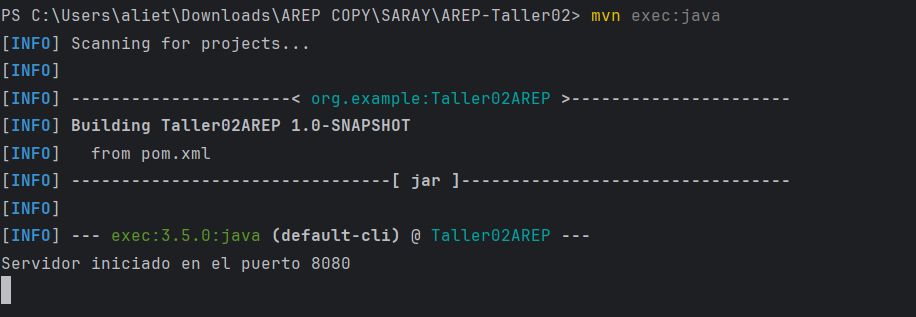
</p>


**5. Accede a la aplicación, buscando en tu navegador:**
   ```
   http://localhost:8080
   ```
*Una vez iniciado el servidor, podrás visualizar la página web en tu navegador.
Además, en la terminal de tu IDE seleccionado, podrás monitorear las 
peticiones HTTP junto con la información relevante que se esté procesando en 
la aplicación.*

<!-- Creación de tabla para alinear las imágenes lado a lado.-->
| 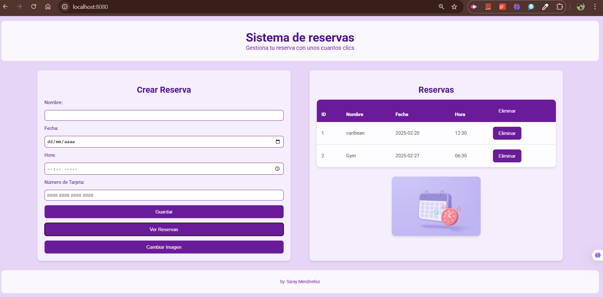 | 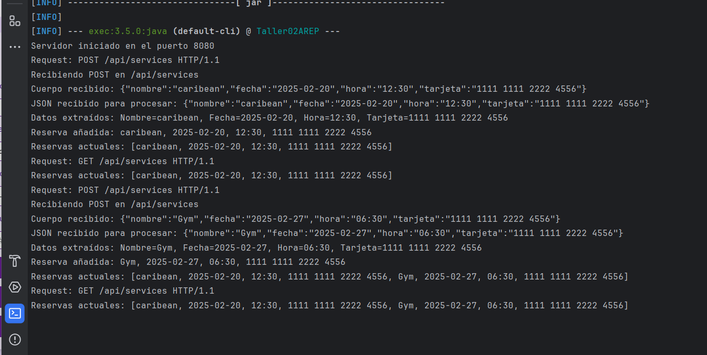 |
|------------------------------------------------------------------------------|-----------------------------------------------------------------------------------|
| **Imagen 1: Página web en navegador**                                        | **Imagen 2: Terminal IDE**                                                        |

---------------------
### ✅ Ejecutar las pruebas

Para ejecutar las pruebas automáticas, el servidor debe estar en ejecución
 ```sh
   mvn exec:java
   ```

<!-- Creación de tabla para alinear las imágenes lado a lado.-->
| 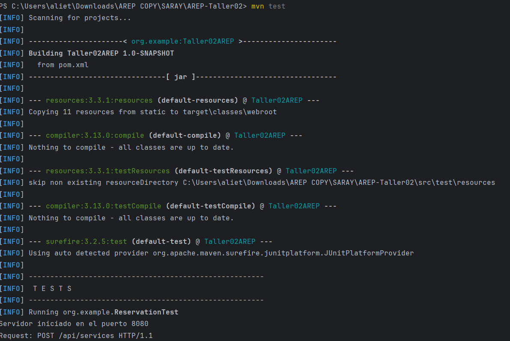 | 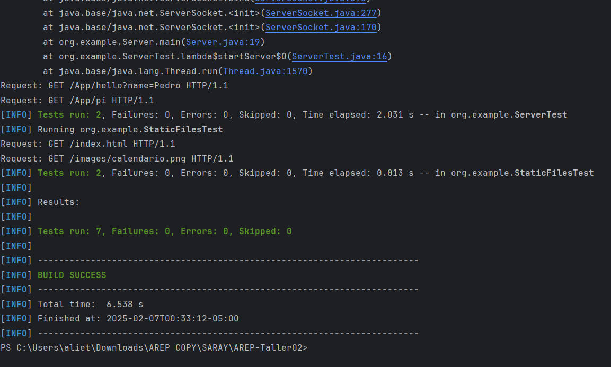 |
|-----------------------------------------------------------------------------|--------------------------------------------------------------------------------|
| **Imagen 1: Página web en navegador**                                       | **Imagen 2: Terminal IDE**                                                     |


Las pruebas incluyen validaciones de:
- Endpoints principales (/App/hello, /App/pi)
- API de reservas (GET, POST, DELETE)
- Archivos estáticos (index.html, imágenes)
------------------------------

### 📂 Cambios Realizados en el Proyecto
Para agregar estos endpoints y mejorar la estructura del servidor, se realizaron las siguientes modificaciones:

#### 📉 Se agregaron los endpoints `/App/hello?name=Pedro` y `/App/pi`
- Ahora el servidor responde dinámicamente a consultas **GET** con parámetros.

#### 📉 Implementación de extracción de parámetros en las rutas GET
- Se añadió soporte para manejar **query parameters** en las solicitudes.

#### 📉 Se ajustó la ubicación de archivos estáticos
- Antes estaban en `static/`, ahora se sirven desde `target/classes/webroot/`.


------------------

###  📚 Endpoints Disponibles en el Servidor

#### ➕ 1. Endpoints para archivos estáticos
- 🌍 [http://localhost:8080/index.html](http://localhost:8080/index.html) → Página principal

<p align="center">
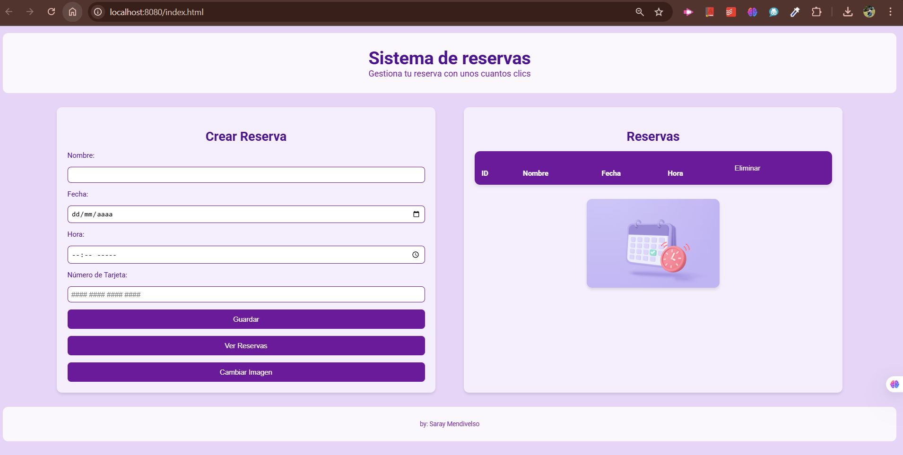
</p>

- 🌍 [http://localhost:8080/static/images/calendario.png](http://localhost:8080/static/images/calendario.png) → Imagen de calendario

<p align="center">
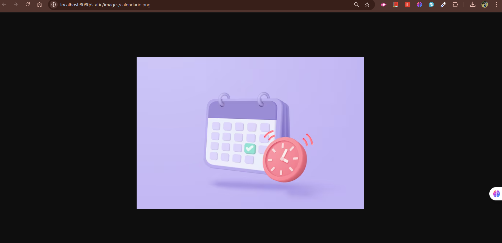
</p>

- 🌍 [http://localhost:8080/static/images/tarjeta.png](http://localhost:8080/static/images/tarjeta.png) → Imagen de tarjeta

<p align="center">
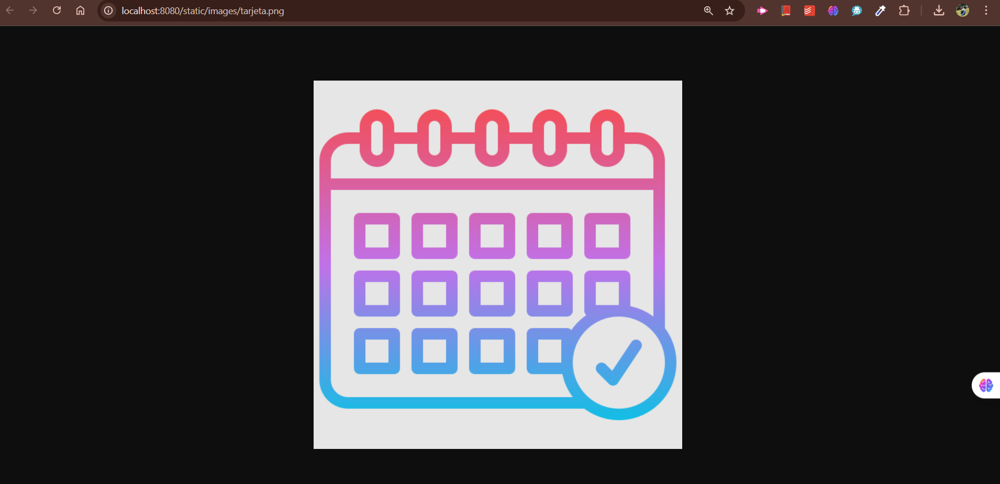
</p>

- 🌍 [http://localhost:8080/static/style.css](http://localhost:8080/static/style.css) → CSS del sitio

<p align="center">
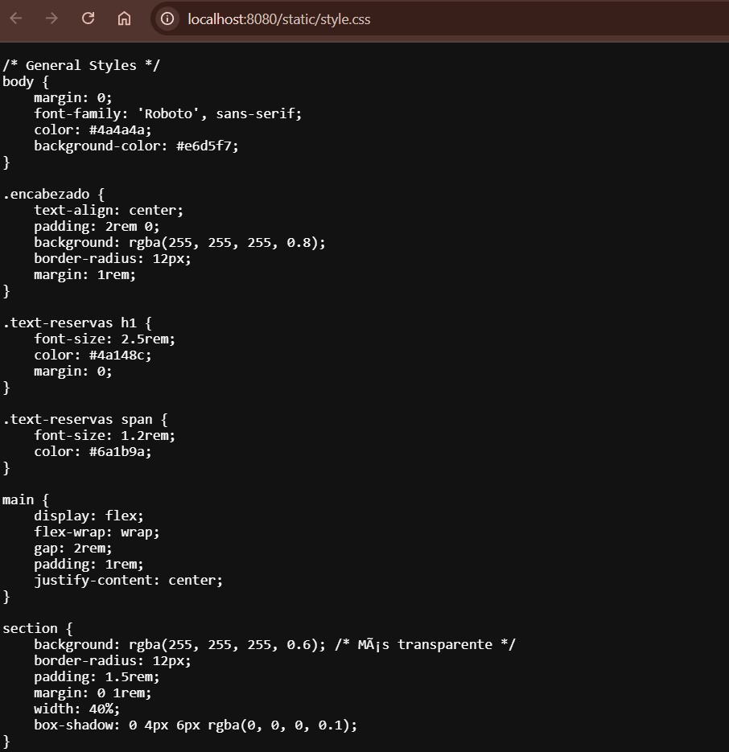
</p>

#### 🔢 2. Endpoints REST (API de reservas)
#### 🔹 Obtener todas las reservas:
- **GET** `http://localhost:8080/api/services`

#### 🟢 Agregar una nueva reserva:
- **POST** `http://localhost:8080/api/services`
- **Cuerpo JSON:**
```json
{
  "nombre": "Juan",
  "fecha": "2025-02-06",
  "hora": "12:00",
  "tarjeta": "1234 5678 9012 3456"
}
```
<p align="center">
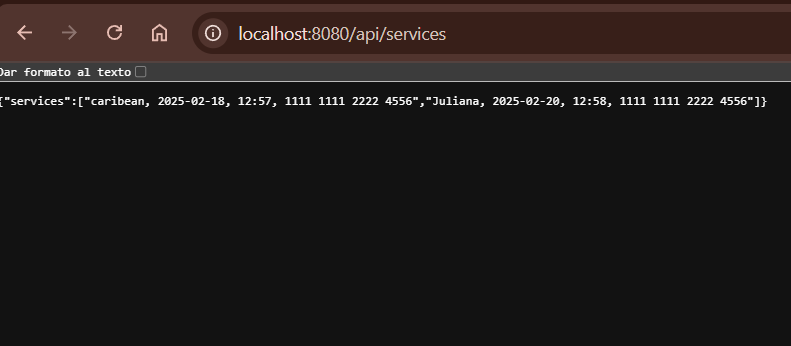
</p>

#### 🔴 Eliminar una reserva específica (por índice):
Los navegadores bloquean solicitudes DELETE por seguridad, entonces para probar que funciona la podemos hacer en el terminal de tu IDE de la siguiente manera:
- **DELETE** `http://localhost:8080/api/services/{id}`
- **Ejemplo:** `http://localhost:8080/api/services/0`

<p align="center">
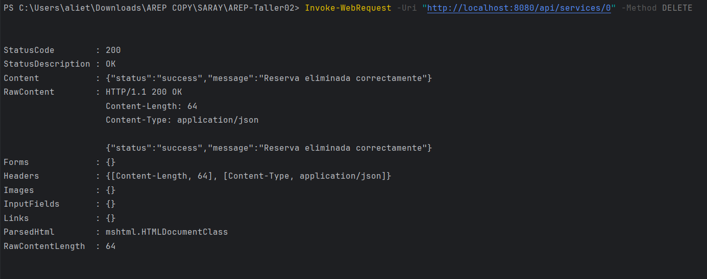
</p>


#### 💡 3. Endpoints adicionales solicitados en el enunciado
- 🌍 [http://localhost:8080/App/hello?name=Pedro](http://localhost:8080/App/hello?name=Pedro) → Devuelve **"Hello Pedro!"**
<p align="center">
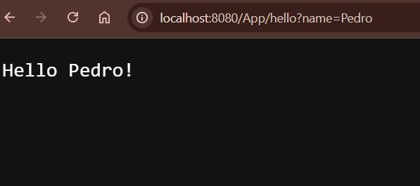
</p>

- 🌍 [http://localhost:8080/App/pi](http://localhost:8080/App/pi) → Devuelve **"3.141592653589793"**

<p align="center">
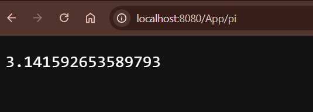
</p>

----------

### 🏗️ Arquitectura
#### Diagrama de clases 

<p align="center">
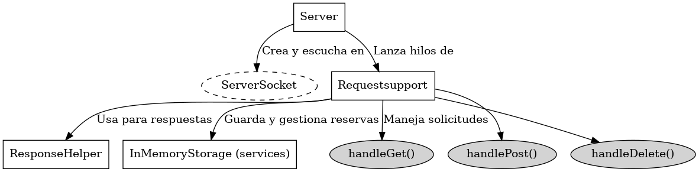
</p>

#### Servidor Java

- Clase principal: Server

- Puerto: 8080

- Raíz web: Recursos/static (directorio desde donde se sirven los archivos estáticos).

#### Manejo de solicitudes:

**GET:**

- `/api/services:` Devuelve una lista de todas las reservas en formato JSON.

- `/api/imgTarjeta:` Devuelve la imagen de la tarjeta almacenada en el servidor.

- Otros archivos estáticos como index.html, style.css y script.js se sirven desde el directorio Recursos/static.

**POST:**

- `/api/services:` Agrega una nueva reserva a la lista de reservas. El cuerpo de la solicitud debe contener un JSON con la reserva.

**DELETE:**

- `/api/services/{id}:` Elimina una reserva específica.

- `/api/services/clear:` Borra todas las reservas.

-------------------- 
### 🌐 Frontend

-- `HTML:` index.html – Interfaz básica para interactuar con el servidor.

-- `CSS:` style.css – Estilos aplicados para hacer que la interfaz se vea profesional y agradable.

-- `JavaScript:` script.js – Maneja la lógica del cliente, como enviar solicitudes al servidor y mostrar los resultados.

-------
### 🚀 Despliegue

Para desplegar este sistema en un entorno en vivo, asegúrate de tener un servidor donde ejecutar la aplicación con Java y Maven.


-----
### 🛠️ Construido con

- [Java](https://www.oracle.com/java/) - Lenguaje de programación
- [Maven](https://maven.apache.org/) - Gestión de dependencias y compilación
- [JUnit](https://junit.org/) - Framework de pruebas

### 👨🏼‍💻 Autora

- **Saray Mendivelso** - Desarrollo inicial


