# WebServer Sistema de Reservas

Este proyecto es un sistema de reservas que permite hacer su gestión a 
través de una interfaz web y una API REST. Además, implementa un servidor web en Java utilizando
Maven, capaz de manejar solicitudes HTTP para proporcionar archivos estáticos
y responder a solicitudes REST para gestionar reservas y mostrar imágenes.


## 📍 Comenzando
Estas instrucciones te permitirán obtener una copia del proyecto en funcionamiento en tu máquina local para propósitos de desarrollo y pruebas.


### 🔧 Prerrequisitos

Para ejecutar el proyecto necesitas instalar:
- [Java JDK 8 o superior](https://www.oracle.com/java/technologies/javase-jdk11-downloads.html)
- [Maven](https://maven.apache.org/download.cgi)
- [Git](https://git-scm.com/)
- Un navegador Web.
- Utiliza el entorno de desarrollo integrado (IDE) de tu preferencia, como por ejemplo: 
  - IntelliJ IDEA, 
  - Eclipse 
  - Apache NetBeans
------------------


### ⚙️ Instalación

**1. Clona el repositorio:**
   ```sh
   git clone https://github.com/saraygonm/AREP-lab04.git
   ```

**2. Entra en la carpeta del proyecto:**
   ```sh
   cd AREP-Taller04
   ```

**3. Compila el proyecto con Maven (debe estar previamente configurado):**
   ```sh
   mvn clean package
   ```

**4. Inicia el servidor(Server.java):**
   ```sh
   mvn exec:java
   ```


<p align="center">

</p>


**5. Accede a la aplicación, buscando en tu navegador:**
   ```
   http://localhost:8080
   ```
*Una vez iniciado el servidor, podrás visualizar la página web en tu navegador.
Además, en la terminal de tu IDE seleccionado, podrás monitorear las 
peticiones HTTP junto con la información relevante que se esté procesando en 
la aplicación.*

<!-- Creación de tabla para alinear las imágenes lado a lado.-->
|  |  |
|------------------------------------------------------------------------------|-----------------------------------------------------------------------------------|
| **Imagen 1: Página web en navegador**                                        | **Imagen 2: Terminal IDE**                                                        |

---------------------
### ✅ Ejecutar las pruebas

Para ejecutar las pruebas automáticas, el servidor debe estar en ejecución
 ```sh
   mvn clean test
   ```

<!-- Creación de tabla para alinear las imágenes lado a lado.-->
| 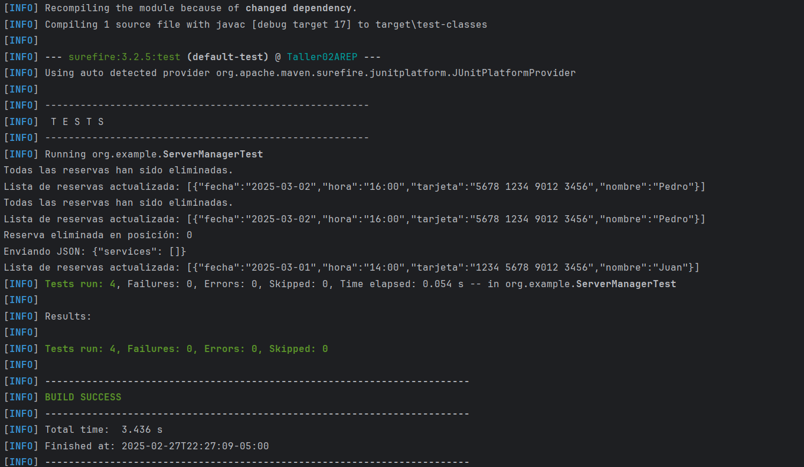 | 
|------------------------------------------------------------------------------|
| **Imagen 1: Prueba**                                                         |


Las pruebas incluyen validaciones de:
- **testPostServices:** Verifica que se pueda agregar una reserva correctamente.
- **testGetAll:** Asegura que el método devuelve la lista de reservas en formato JSON.
- **testDeleteService:** Comprueba que se pueda eliminar una reserva correctamente.
- **testClearAllServices:** Confirma que todas las reservas puedan ser eliminadas.
------------------

###  📚 Endpoints Disponibles en el Servidor

#### ➕ 1. Endpoint para archivos estáticos
- 🌍 [http://localhost:8080/index.html](http://localhost:8080/index.html) → Página principal

<p align="center">

</p>


#### 🔢 2. Endpoints REST (API de reservas)
#### 🔹 Obtener todas las reservas:
- **GET** `http://localhost:8080/api/services`

#### 🟢 Agregar una nueva reserva:
- **POST** `http://localhost:8080/api/services`
- **Cuerpo JSON:**
```json
{
  "nombre": "Juan",
  "fecha": "2025-02-06",
  "hora": "12:00",
  "tarjeta": "1234 5678 9012 3456"
}
```
<p align="center">

</p>


----------

### 🏗️ Arquitectura

#### Diagrama de clases

<p align="center">

</p>


#### Diagrama de Secuencia

<p align="center">
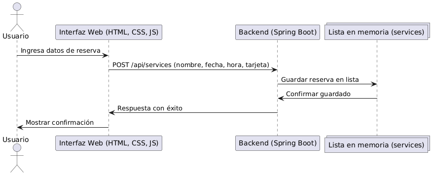
</p>

#### Diagrama de despliegue

<p align="center">
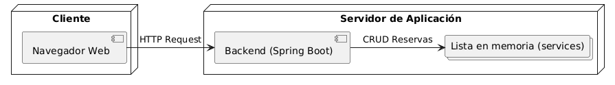
</p>

#### Diagrama Componentes

<p align="center">
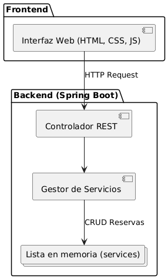
</p>


###  Arquitectura desplegada en Docker
- Construcción de la imagen Docker

<p align="center">
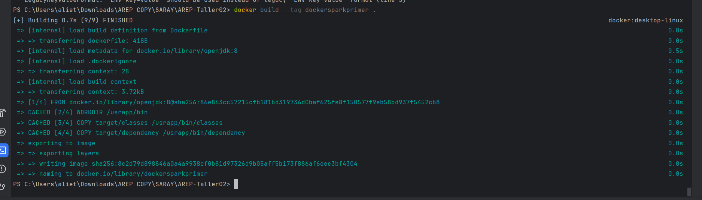
</p>

- Verificación de que la imagen fue creada
<p align="center">
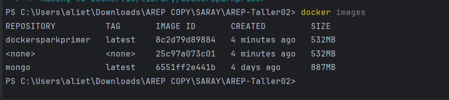
</p>

- Se crean y se ejecutan tres contenedores independientes 
<p align="center">
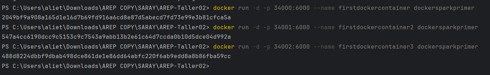
</p>

- Verificación que los contenedores están corriendo

<p align="center">
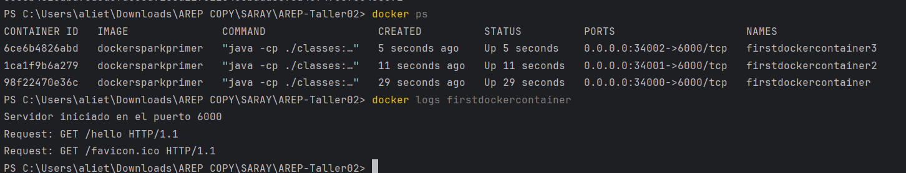
</p>

De igual manera, utilizamos Postman para realizar una solicitud de tipo POST 
<!-- Creación de tabla para alinear las imágenes lado a lado.-->
| 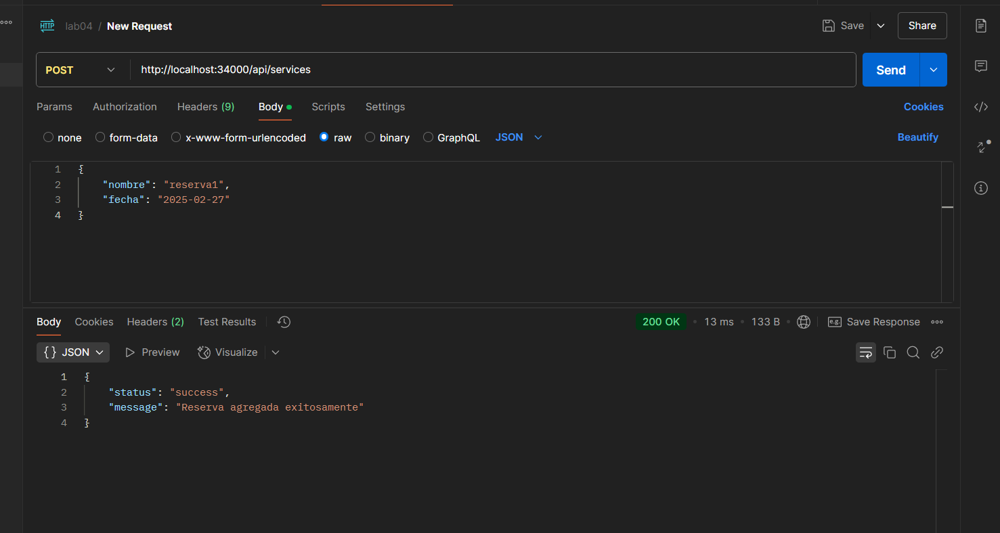 | 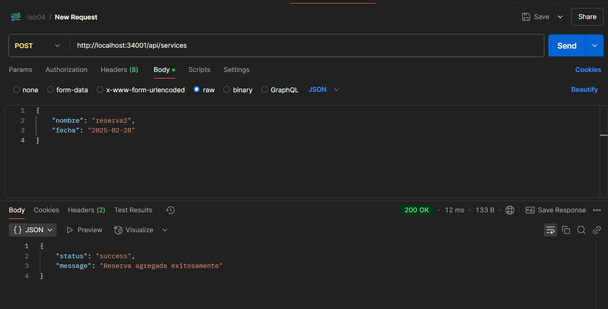 | 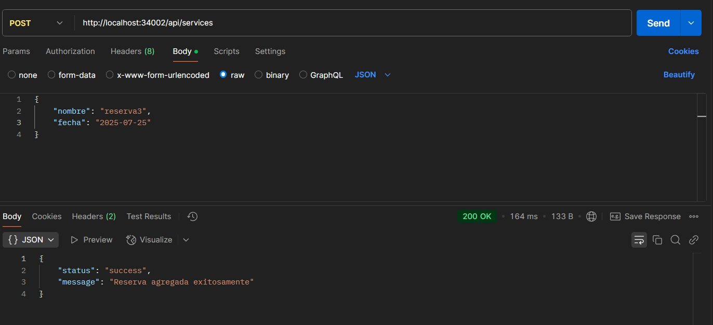 |
|------------------------------------------------------------------|------------------------------------------------------------------|----------------------------------------------------------|
| **Solicitud Post reserva1**                                      | **Solicitud Post reserva2**                                      | **Solicitud Post reserva3**                              |

Verificación de que los contenedores funcionen correctamente en el navegador.

| 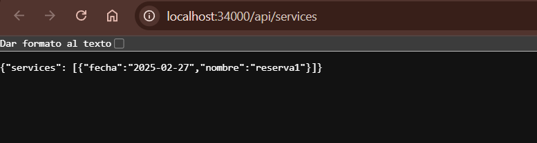 | 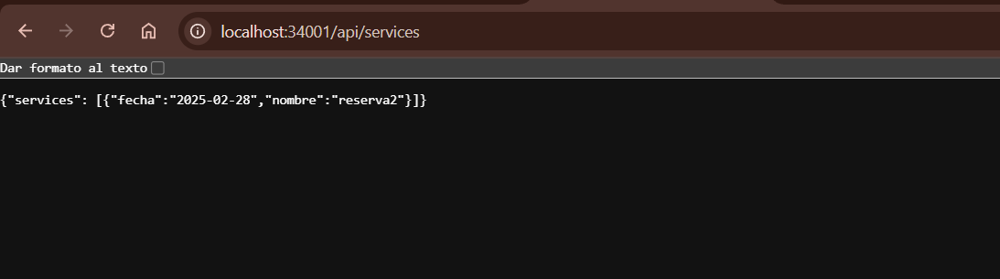 | 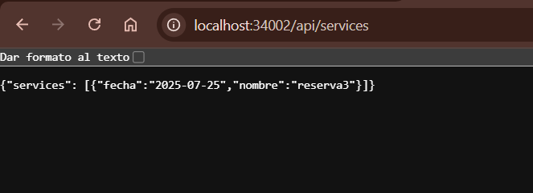 |
|-----------------------------------------------------------------------|-----------------------------------------------------------------------|----------------------------------------------------------------|
| **Visualizacion localhost:34000**                 | **Visualizacion localhost:34001**                                     | **Visualizacion localhost:34002**                              |

- Ahora se inician todos los servicios definidos en el docker-compose.yml
<p align="center">
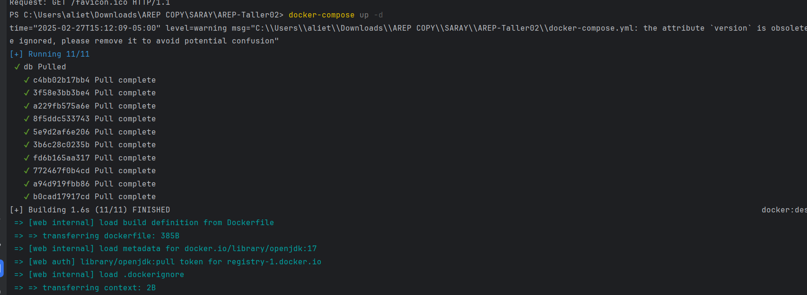
</p>


- Luego se crea un nuevo repositorio en Dockerhub,  creamos una etiqueta para la imagen desde la terminal y verificamos su existencia 
<!-- Creación de tabla para alinear las imágenes lado a lado.-->
| 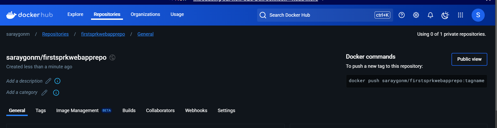 | 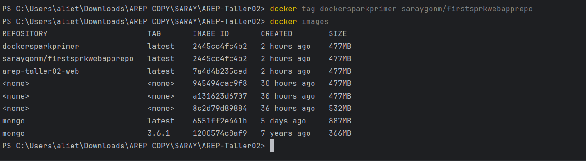 |
|------------------------------------------------------------|-------------------------------------------------------------|
| **Repositorio en DockerHub**                               | **Verificación en la terminal**                             |

- Para subir la imagen  debemos seguir los siguientes comandos 
<p align="center">
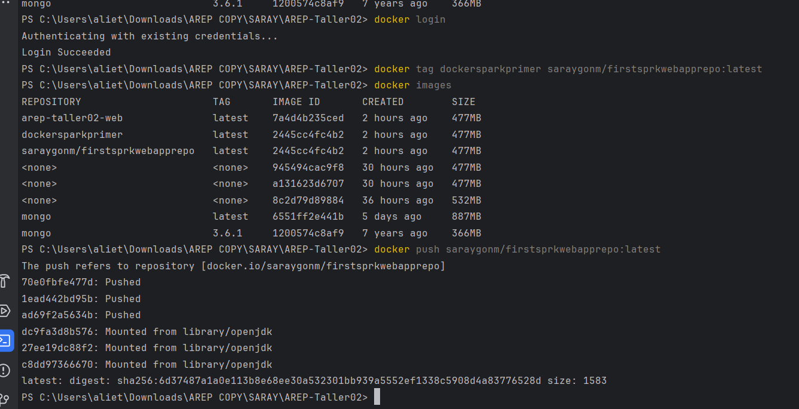
</p>

- Luego veremos nuestra imagen en DockerHub
<p align="center">

</p>


#### Servidor Java

- Clase principal: Server

- Puerto: 8080

- Raíz web: Recursos/static (directorio desde donde se sirven los archivos estáticos).

#### Manejo de solicitudes:

**GET:**

- `/api/services:` Devuelve una lista de todas las reservas en formato JSON.


**POST:**

- `/api/services:` Agrega una nueva reserva a la lista de reservas. El cuerpo de la solicitud debe contener un JSON con la reserva.


-------------------- 
### 🌐 Frontend

-- `HTML:` index.html – Interfaz básica para interactuar con el servidor.

-- `CSS:` style.css – Estilos aplicados para hacer que la interfaz se vea profesional y agradable.

-- `JavaScript:` script.js – Maneja la lógica del cliente, como enviar solicitudes al servidor y mostrar los resultados.

-------
### 🚀 Despliegue

Para desplegar este sistema en un entorno en vivo, asegúrate de tener un servidor donde ejecutar la aplicación con Java y Maven.


-----
### 🛠️ Construido con

- [Java](https://www.oracle.com/java/) - Lenguaje de programación
- [Maven](https://maven.apache.org/) - Gestión de dependencias y compilación
- [JUnit](https://junit.org/) - Framework de pruebas

### 👨🏼‍💻 Autora

- **Saray Mendivelso** - Desarrollo inicial


